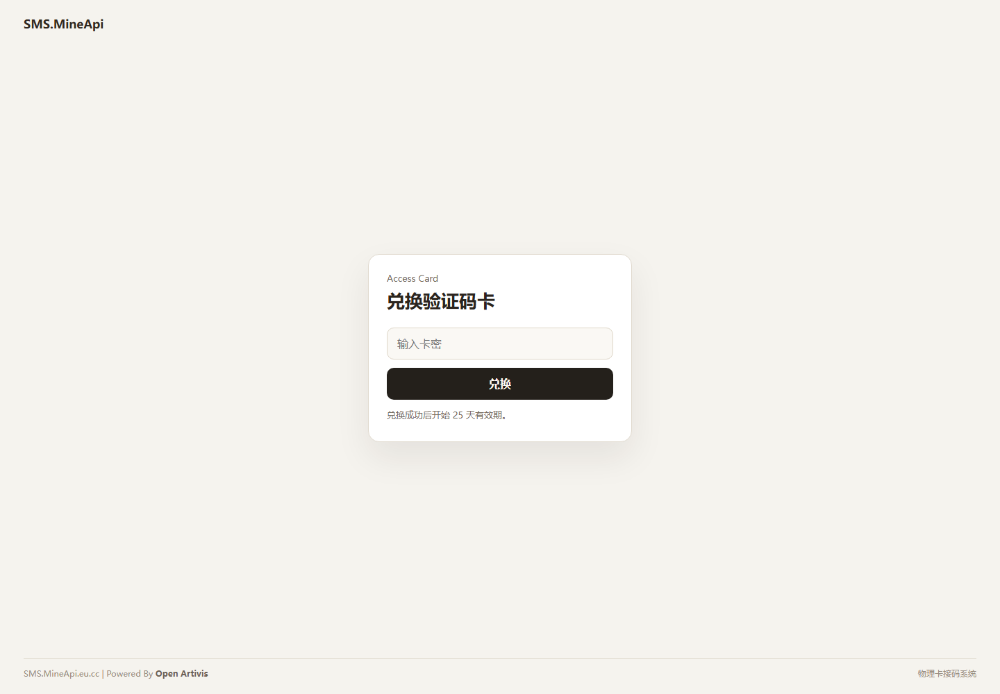
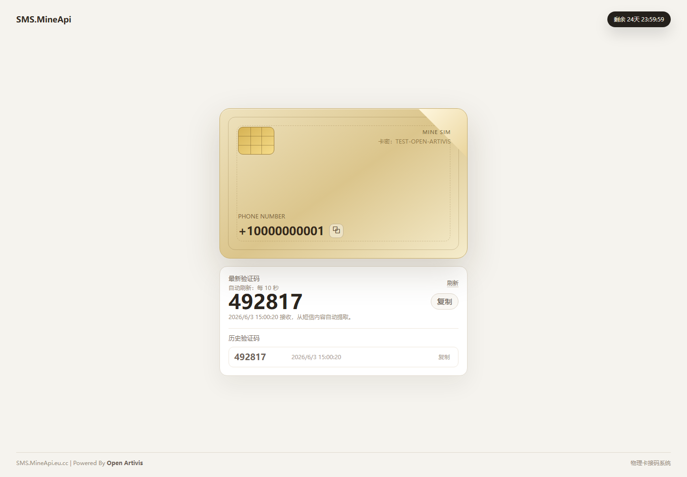
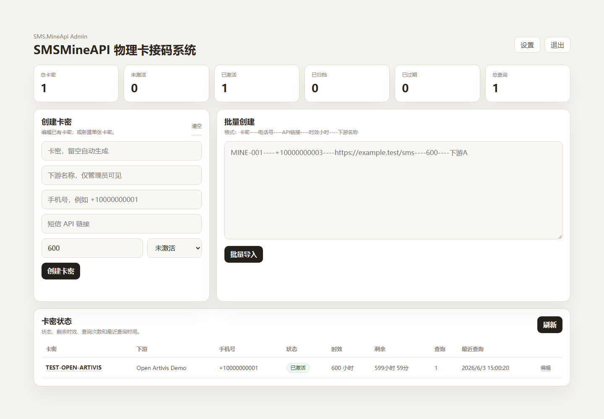

# SMS.MineApi

SMS.MineApi 是一个极简的实体 SIM 卡接码 / 卡密兑换系统。管理员可以在后台创建卡密，将卡密绑定到手机号和短信 API 链接；用户在前台输入卡密后，只能看到手机号和验证码，不会暴露上游 API 链接。

项目由 **Open Artivis** 开源社区维护。


## 项目截图

### 主页



### 兑换成功



### 管理后台



## 功能特性

- 卡密兑换：用户输入卡密后显示手机号和验证码。
- 隐藏上游：用户侧接口不会返回短信 API 链接。
- 自动刷新：前台按配置周期自动拉取验证码，也支持手动刷新。
- 历史验证码：按接收时间展示历史验证码，并做重复内容过滤。
- 有效期：卡密首次兑换后开始倒计时，到期自动归档。
- 后台管理：创建、编辑、批量导入卡密，查看激活状态、查询次数和详情。
- 下游备注：卡密可记录下游名称，仅管理员可见。
- 站点设置：后台可修改首页 LOGO、SIM 标题、版权、系统名、后台标题和管理员密码。
- SQLite 存储：无需额外数据库服务，适合轻量部署。

## 技术栈

- Node.js
- Express
- SQLite / better-sqlite3
- 原生 HTML / CSS / JavaScript
- Vitest + Supertest
- Playwright 用于截图和前端验证

## 快速开始

```bash
npm install
cp .env.example .env
npm run demo:init
npm start
```

访问：

- 前台：`http://localhost:7060`
- 后台：`http://localhost:7060/admin.html`

演示数据：

- 测试卡密：`TEST-OPEN-ARTIVIS`
- 管理员密码：`Minier123`

> 生产环境请立即修改 `ADMIN_PASSWORD`、`SESSION_SECRET` 和后台设置里的管理员密码。

## 配置说明

`.env.example`：

```env
PORT=7060
DATABASE_PATH=./data/sms-mineapi.sqlite
SESSION_SECRET=replace-with-a-long-random-string
ADMIN_PASSWORD=Minier123
DEFAULT_DURATION_DAYS=25
SMS_FETCH_TIMEOUT_MS=10000
AUTO_REFRESH_SECONDS=10
```

字段说明：

| 字段 | 说明 |
| --- | --- |
| `PORT` | 服务端口 |
| `DATABASE_PATH` | SQLite 数据库路径 |
| `SESSION_SECRET` | 后台登录 Cookie 加密密钥 |
| `ADMIN_PASSWORD` | 初始管理员密码，数据库未设置密码时作为兜底 |
| `DEFAULT_DURATION_DAYS` | 默认卡密有效期天数 |
| `SMS_FETCH_TIMEOUT_MS` | 拉取上游短信 API 的超时时间 |
| `AUTO_REFRESH_SECONDS` | 前台自动刷新间隔 |

## 后台使用

登录后台后可以：

- 创建单张卡密
- 编辑已有卡密的手机号、API 链接、状态、有效期、下游备注
- 批量导入卡密
- 查看卡密状态、查询次数、最近查询时间
- 点击卡密查看详情，包括激活时间、上次查询时间、API 链接和已收到的验证码
- 修改站点展示文案和管理员密码

批量导入格式：

```txt
卡密----电话号----API链接----时效小时----下游名称
```

示例：

```txt
TEST-001----+10000000001----http://localhost:7060/demo-sms----600----Open Artivis Demo
```

## 短信 API 返回格式

系统会从上游接口返回内容中自动提取验证码。上游可以返回纯文本或 JSON。

示例：

```json
{
  "message": "Your verification code is 492817",
  "receivedAt": "2026-06-03T00:00:00.000Z"
}
```

验证码提取逻辑会忽略“暂无短信”和链接到期时间这类无验证码内容，避免把年份误识别成验证码。

## 安全建议

- 不要把真实上游短信 API 链接提交到公开仓库。
- 生产环境不要使用演示密码 `Minier123`。
- 生产环境必须修改 `SESSION_SECRET`。
- 建议使用 HTTPS 和反向代理部署。
- 后台路径建议放在访问控制或内网环境中。
- 如果开放给下游系统调用，请新增独立 OpenAPI 层，不要直接暴露后台接口。

## 开发命令

```bash
npm test
npm run check
npm run demo:init
npm start
```

## 目录结构

```txt
SMS.MineApi/
  public/              # 前台和后台静态页面
  public/assets/       # Open Artivis 标识资源
  src/                 # Express 服务端
  scripts/             # 演示数据和辅助脚本
  tests/               # 单元和接口测试
  docs/screenshots/    # README 展示截图
```

## 开源社区

SMS.MineApi 由 **Open Artivis** 开源社区维护。欢迎基于本项目进行二次开发、私有部署和功能扩展。

## 许可

请根据你的发布计划添加许可证文件，例如 MIT、Apache-2.0 或自定义许可证。
